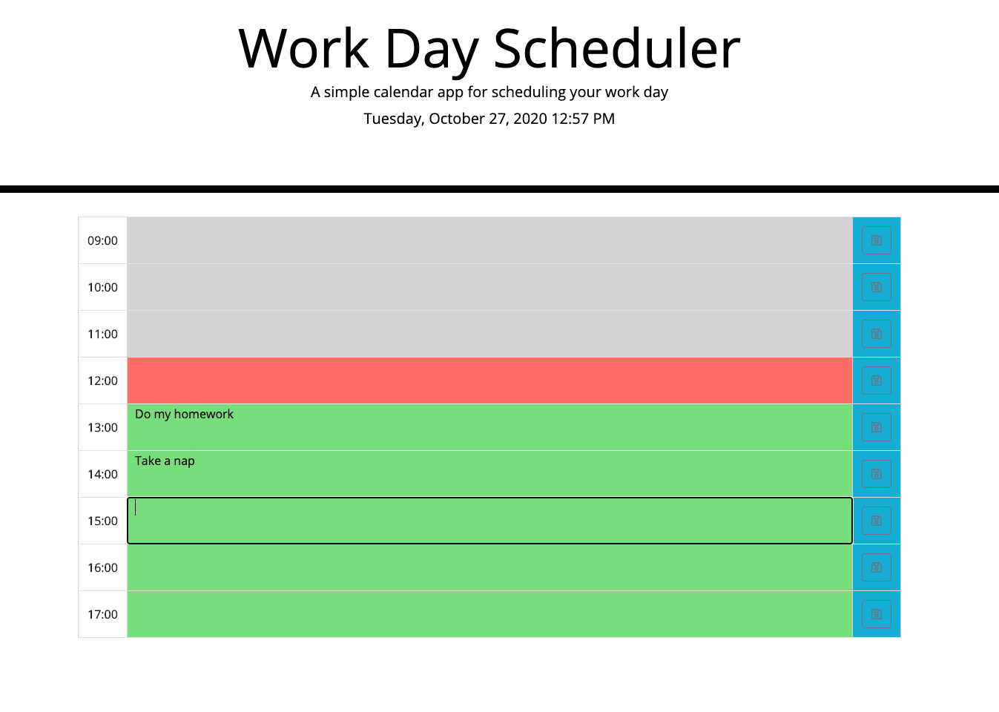

# Work-Day-Scheduler-HW5

# 05 Third-Party APIs: Work Day Scheduler

INTRUDUCTION

This is a daily planner to create a schedule. The current day and time is displayed at the top of the calendar, and the user is presented with time blocks for standard business hours. Eeach time block is color-coded to indicate whether it is in the past, present, or future.  Events can be entered and saved for future use.

USER INTERFACE

The user is presented with a daily schedule table, "to-do" items can be added to the center column and saved by clicking the save icon on the far right columns.  The to-do items will remain on the saved cell until the user erases and and saves a new to do item.

USER STEPS

A daily planner is shown for hourly schedule from 9AM to 5PM (17:00).

1.  Type to-do item on the desire time row.
2.  Click on the save icon to save the changes to the row.
3.  Erase to-do item and click on the save icon to clear the row.

Current time slot is shown in red, past time slots are colored gray, and future time slots are shown in light-green.

* Deployed application:
https://samrod777.github.io/Work-Day-Scheduler-HW5/

* GitHub repository URL:
https://github.com/samrod777/Work-Day-Scheduler-HW5

- - -
© 2020 Sam Rodriguez. All Rights Reserved.
